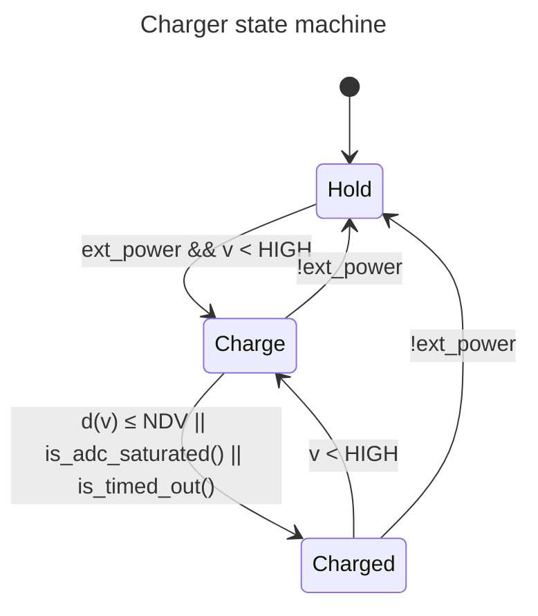

# Clock

This [Pico](https://www.raspberrypi.com/documentation/microcontrollers/raspberry-pi-pico.html)-based clock uses a dedicated oscillator for the built-in RP2040 [RTC](https://datasheets.raspberrypi.com/rp2040/rp2040-datasheet.pdf#section_rtc), displays time using seven-segment indicators, features capacitive touch-sensing buttons, and a custom built-in NiMH charging circuit.

The estimated run-time on a single charge is _one week_ (yes, _just_ one week).

When assembling, refer to the [interactive BOM](https://htmlpreview.github.io/?https://github.com/werediver/clock/blob/main/KiCad/bom/ibom.html) page.

## NiMH battery charger

- [ ] Add a time-out for `v ≥ NiMH_HIGH` (1–2h?)
